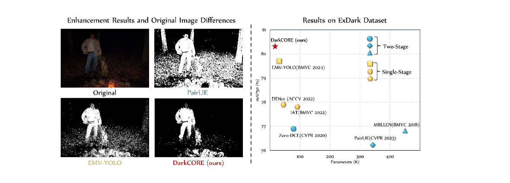
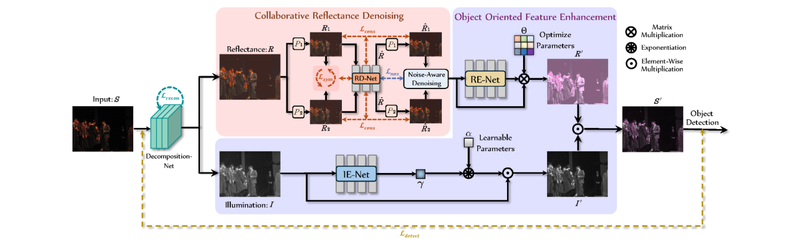
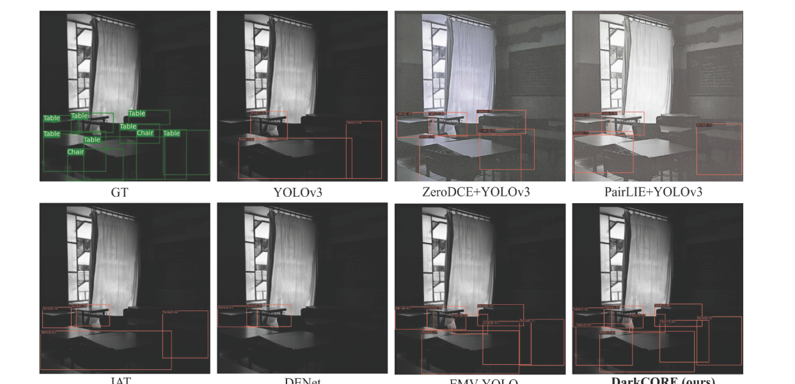
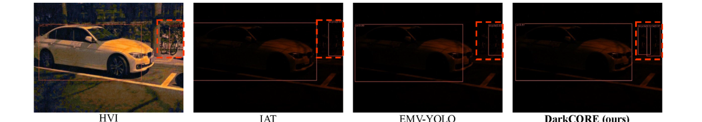

# DarkCORE: Efficient Low-Light Object Detection via Collaborative Reflectance Denoising and Object-Oriented Feature Enhancement

[](https://doi.org/10.1016/j.eswa.2026.132424)
[](LICENSE)

> **[DarkCORE: Efficient low-light object detection via collaborative reflectance denoising and object-oriented feature enhancement](https://doi.org/10.1016/j.eswa.2026.132424)**
> Xin Feng, Jie Wang, Yunlong Wang, Junxian Zeng, Di Ming
> *Expert Systems With Applications (ESWA), 2026* | [DOI](https://doi.org/10.1016/j.eswa.2026.132424)

---



## 📖 Introduction

Object detectors trained on high-quality datasets often suffer severe performance degradation under low-light conditions, mainly due to amplified noise and distorted textures introduced by conventional enhancement methods. Most existing approaches focus primarily on brightness and contrast adjustment, which are designed for **human visual perception** and often fail to meet the requirements of downstream detection tasks. In addition, their denoising techniques rely on single-branch constraints and struggle to balance noise suppression with detail preservation under complex lighting conditions.

**DarkCORE** is a detection-oriented and efficient low-light object detection framework that integrates **Collaborative Reflectance Denoising** and **Object-Oriented Feature Enhancement**:

- **Collaborative Reflectance Denoising (RD-Net):** Based on Retinex decomposition, a multi-branch **self-supervised** denoising strategy is applied to the reflectance component. By leveraging inter-branch structural differences (symmetric-consistency constraint + noise-aware selection constraint), it effectively reduces noise while preserving object-level details — **without requiring any clean reference images**.
- **Object-Oriented Feature Enhancement (RE-Net & IE-Net):** Two lightweight networks enhance object-oriented features in the latent feature space for both reflectance (RE-Net) and illumination (IE-Net), enabling end-to-end joint optimization with the detector.
- **Extremely lightweight:** only **20K** additional parameters, making it a plug-and-play enhancement module suitable for resource-constrained edge devices and real-time applications.



## ✨ Highlights

- 🔦 Multi-branch collaborative self-supervised denoising explicitly addresses the limitations of single-branch denoising in low-light detection.
- 🎯 Object-oriented feature enhancement bridges the gap between low-light enhancement (human-vision-oriented) and downstream object detection (machine-vision-oriented).
- 🪶 Only **20K** extra parameters — an effective trade-off between detection accuracy and computational efficiency.
- 🔌 Detector-agnostic: works with both anchor-based (YOLOv3) and transformer-based (DETR) detectors.

## 📊 Results

### ExDark (mAP50 %, YOLOv3 detector)

<table>
<thead>
<tr><th>Type</th><th>Method</th><th>Bicycle</th><th>Boat</th><th>Bottle</th><th>Bus</th><th>Car</th><th>Cat</th><th>Chair</th><th>Cup</th><th>Dog</th><th>Motorbike</th><th>People</th><th>Table</th><th>mAP50</th></tr>
</thead>
<tbody>
<tr><td>Baseline</td><td>YOLOv3</td><td>79.8</td><td>75.3</td><td>78.1</td><td>92.3</td><td>83.0</td><td>68.0</td><td>69.0</td><td>79.0</td><td>78.0</td><td>77.3</td><td>81.5</td><td>55.5</td><td>76.4</td></tr>
<tr><td rowspan="6">Two-stage</td><td>MBLLEN (BMVC'18) + YOLOv3</td><td>82.2</td><td>76.7</td><td>76.5</td><td>92.5</td><td>83.1</td><td>72.4</td><td>71.5</td><td>77.3</td><td>78.5</td><td>74.5</td><td>80.8</td><td>55.6</td><td>76.8</td></tr>
<tr><td>KinD (MM'19) + YOLOv3</td><td>80.9</td><td>75.0</td><td>75.8</td><td>93.3</td><td>82.4</td><td>69.4</td><td>69.2</td><td>79.0</td><td>76.9</td><td>76.3</td><td>79.6</td><td>55.4</td><td>76.1</td></tr>
<tr><td>Zero-DCE (CVPR'20) + YOLOv3</td><td>84.1</td><td>77.6</td><td>78.3</td><td>93.1</td><td>83.7</td><td>70.3</td><td>69.8</td><td>77.6</td><td>77.4</td><td>76.3</td><td>81.0</td><td>53.6</td><td>76.9</td></tr>
<tr><td>Retinexformer (ICCV'23) + YOLOv3</td><td>82.0</td><td>80.1</td><td>80.9</td><td>91.3</td><td>83.1</td><td>70.8</td><td>70.3</td><td>76.9</td><td>75.8</td><td>75.4</td><td>80.8</td><td>57.8</td><td>77.1</td></tr>
<tr><td>PairLIE (CVPR'23) + YOLOv3</td><td>82.5</td><td>76.7</td><td>76.4</td><td>91.6</td><td>82.9</td><td>71.0</td><td>70.0</td><td>76.9</td><td>78.9</td><td>72.6</td><td>79.9</td><td>55.3</td><td>76.2</td></tr>
<tr><td>HVI (CVPR'25) + YOLOv3</td><td>79.7</td><td>75.8</td><td>75.1</td><td>91.8</td><td>82.3</td><td>69.8</td><td>72.0</td><td>74.8</td><td>77.4</td><td>77.2</td><td>79.5</td><td>54.3</td><td>76.1</td></tr>
<tr><td rowspan="7">Single-stage</td><td>MAET (ICCV'21)</td><td>83.1</td><td>78.5</td><td>75.6</td><td>92.9</td><td>83.1</td><td>73.4</td><td>71.3</td><td>79.0</td><td>79.8</td><td>77.2</td><td>81.1</td><td>57.0</td><td>77.7</td></tr>
<tr><td>IAT (BMVC'22)</td><td>79.8</td><td>76.9</td><td>78.6</td><td>92.5</td><td>83.8</td><td>73.6</td><td>72.4</td><td>78.6</td><td>79.0</td><td>79.0</td><td>81.1</td><td>57.7</td><td>77.8</td></tr>
<tr><td>DENet (ACCV'22)</td><td>80.9</td><td>79.2</td><td>80.1</td><td>90.7</td><td>84.5</td><td>70.7</td><td>72.0</td><td>79.3</td><td>80.1</td><td>76.7</td><td>82.4</td><td>58.0</td><td>77.9</td></tr>
<tr><td>PE-YOLO (PRL'23)</td><td>84.7</td><td>79.2</td><td>79.3</td><td>92.5</td><td>83.9</td><td>71.5</td><td>71.7</td><td>79.7</td><td>79.7</td><td>77.3</td><td>81.8</td><td>55.3</td><td>78.0</td></tr>
<tr><td>DAI-Net (AAAI'24)</td><td>83.8</td><td>75.8</td><td>75.1</td><td>94.2</td><td>84.1</td><td>74.9</td><td>73.1</td><td>79.2</td><td>82.2</td><td>76.4</td><td>80.7</td><td>59.8</td><td>78.3</td></tr>
<tr><td>EMV-YOLO (ESWA'24)</td><td>82.8</td><td>79.7</td><td>79.8</td><td>94.1</td><td>84.7</td><td>74.3</td><td>74.1</td><td>83.1</td><td>82.7</td><td>78.1</td><td>83.6</td><td>59.3</td><td><ins>79.7</ins></td></tr>
<tr><td><b>DarkCORE (ours)</b></td><td>84.2</td><td>80.1</td><td>77.4</td><td>93.1</td><td>84.4</td><td><b>75.2</b></td><td><b>76.5</b></td><td>81.0</td><td><b>84.4</b></td><td><b>81.8</b></td><td><b>84.0</b></td><td><b>61.1</b></td><td><b>80.3</b></td></tr>
</tbody>
</table>

> Across multiple independent runs, DarkCORE achieves an average mAP of **80.1 ± 0.18** on ExDark.

### UG2+ DarkFace (mAP50 %, YOLOv3 detector)

<table>
<thead>
<tr><th>Type</th><th>Method</th><th>mAP50</th></tr>
</thead>
<tbody>
<tr><td>Baseline</td><td>YOLOv3</td><td>48.3</td></tr>
<tr><td rowspan="6">Two-stage</td><td>MBLLEN + YOLOv3</td><td>51.6</td></tr>
<tr><td>KinD + YOLOv3</td><td>51.6</td></tr>
<tr><td>Zero-DCE + YOLOv3</td><td>54.2</td></tr>
<tr><td>Retinexformer + YOLOv3</td><td><ins>57.4</ins></td></tr>
<tr><td>PairLIE + YOLOv3</td><td>55.4</td></tr>
<tr><td>HVI + YOLOv3</td><td>57.0</td></tr>
<tr><td rowspan="7">Single-stage</td><td>MAET</td><td>55.8</td></tr>
<tr><td>IAT</td><td>53.1</td></tr>
<tr><td>DENet</td><td>51.2</td></tr>
<tr><td>PE-YOLO</td><td>51.1</td></tr>
<tr><td>DAI-Net</td><td>57.0</td></tr>
<tr><td>EMV-YOLO</td><td>57.6</td></tr>
<tr><td><b>DarkCORE (ours)</b></td><td><b>58.2</b></td></tr>
</tbody>
</table>

> Average over multiple runs: **57.8 ± 0.4**.

### LOD (mAP50 %, YOLOv3 detector)

| Method | Bicycle | Bottle | Bus | Car | Chair | Diningtable | Motorbike | Tvmonitor | **mAP50** |
|---|---|---|---|---|---|---|---|---|---|
| YOLOv3 | 66.7 | 62.8 | 91.2 | 90.4 | 70.6 | 66.3 | 63.0 | 72.8 | 73.0 |
| PairLIE + YOLOv3 | 66.6 | 66.1 | 89.3 | 90.5 | 70.4 | 65.1 | **68.9** | 64.3 | 72.6 |
| HVI + YOLOv3 | 66.7 | 63.2 | 92.3 | 89.8 | 71.4 | 69.4 | 67.1 | 72.7 | 74.1 |
| IAT | 67.8 | 61.6 | 89.9 | **91.7** | 71.7 | **71.7** | 64.6 | 68.5 | 73.4 |
| EMV-YOLO | 69.7 | 70.6 | **93.2** | 91.3 | 71.9 | 68.4 | 62.5 | 74.0 | <ins>75.2</ins> |
| **DarkCORE (ours)** | **70.0** | **70.9** | 89.8 | 91.4 | **72.0** | 70.8 | 67.7 | **77.2** | **76.2** |

### Efficiency (enhancement module only, YOLOv3 detector fixed)

| Method | Parameters | Runtime (ms) | FLOPs (G) |
|---|---|---|---|
| MBLLEN | 450K | 38.1 | 81.98 |
| KinD | 8M | 14.8 | 54.17 |
| Zero-DCE | 79K | 4.7 | 23.44 |
| PairLIE | 342K | 13.6 | 100.91 |
| IAT | 90K | 13.8 | 6.48 |
| DENet | 45K | **3.3** | **1.42** |
| PE-YOLO | 91K | 32.2 | 8.11 |
| EMV-YOLO | <ins>27K</ins> | 6.0 | 5.17 |
| **DarkCORE (ours)** | **20K** | <ins>5.6</ins> | <ins>4.34</ins> |

### Visual Results

Visual comparison of enhancement and detection results on **ExDark** (last column: ours):



Detection results on **LOD** compared with HVI, IAT and EMV-YOLO:



## 🛠️ Installation

This repo is built upon [MMDetection](https://github.com/open-mmlab/mmdetection) 2.15.1.

1. Install `mmcv-full` (1.3.8 ~ 1.4.0) matching your CUDA/PyTorch version, e.g.:

```bash
pip install mmcv-full==1.4.0 -f https://download.openmmlab.com/mmcv/dist/cu110/torch1.7.1/index.html
```

2. Install dependencies and build mmdet:

```bash
pip install opencv-python scipy
pip install -r requirements/build.txt
pip install -v -e .
```

## 📦 Datasets

- **ExDark**: download (VOC format, including enhancements by MBLLEN / Zero-DCE / KinD) from [Google Drive](https://drive.google.com/file/d/1X_zB_OSp_thhk9o26y1ZZ-F85UeS0OAC/view?usp=sharing) or [BaiduYun](https://pan.baidu.com/s/1m4BMVqClhMks4S0xulkCcA) (passwd: 1234), then `tar -zxvf EXDark.tar.gz`. We follow the 80% / 20% train/test split of [MAET (ICCV 2021)](https://github.com/cuiziteng/ICCV_MAET).
- **UG2+ DarkFace**: see the [official site](https://cvlab.cse.msu.edu/project-ug2detection.html); 5,400 images for training and 600 for testing.
- **LOD**: see [LOD dataset](https://github.com/ying-fu/LODDataset); split by category with an 8:2 ratio.

The dataset structure should look like:

```
EXDark
└───JPEGImages
│   │───IMGS (original low light)
│   │───IMGS_Kind
│   │───IMGS_ZeroDCE
│   │───IMGS_MEBBLN
│───Annotations
│───main
│───label
```

Then modify the data paths in `configs/_base_/datasets/` to your own locations.

## 🚀 Usage

### Training

YOLOv3-based DarkCORE (single GPU, batch size 8):

```bash
# ExDark
python tools/train.py configs/yolo/yolov3_DarkCORE_Exdark.py --gpu-ids 0
# DarkFace
python tools/train.py configs/yolo/yolov3_DarkCORE_DarkFace.py --gpu-ids 0
# LOD
python tools/train.py configs/yolo/yolov3_DarkCORE_LOD.py --gpu-ids 0
```

DETR-based DarkCORE (2 GPUs, batch size 2 per GPU):

```bash
CUDA_VISIBLE_DEVICES=0,1 PORT=29501 bash tools/dist_train.sh configs/detr/detr_exdark_DarkCORE.py 2
```

### Testing

```bash
python tools/test.py configs/yolo/yolov3_DarkCORE_Exdark.py <checkpoint.pth> --eval mAP
```

## 📝 Citation

If you find this work useful, please cite:

```bibtex
@article{feng2026darkcore,
  title   = {DarkCORE: Efficient low-light object detection via collaborative reflectance denoising and object-oriented feature enhancement},
  author  = {Feng, Xin and Wang, Jie and Wang, Yunlong and Zeng, Junxian and Ming, Di},
  journal = {Expert Systems With Applications},
  volume  = {323},
  pages   = {132424},
  year    = {2026},
  doi     = {10.1016/j.eswa.2026.132424}
}
```

## 🙏 Acknowledgement

This code is built upon [MMDetection](https://github.com/open-mmlab/mmdetection) and [Illumination-Adaptive-Transformer (IAT)](https://github.com/cuiziteng/Illumination-Adaptive-Transformer). We also thank [MAET](https://github.com/cuiziteng/ICCV_MAET) for the ExDark data split.
