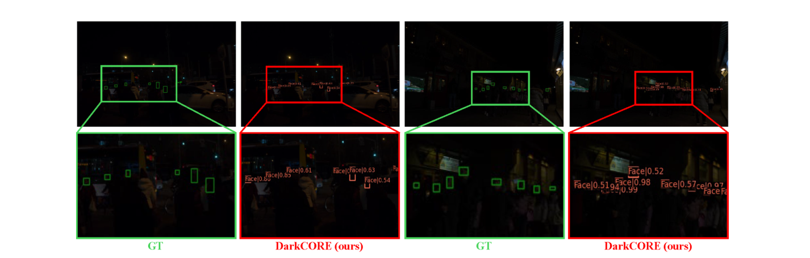
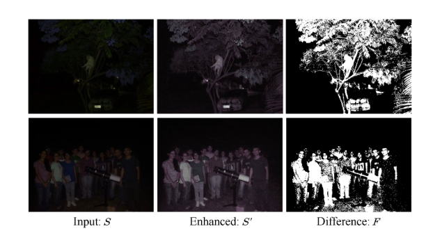

# DarkCORE: Efficient Low-Light Object Detection via Collaborative Reflectance Denoising and Object-Oriented Feature Enhancement

[](https://doi.org/10.1016/j.eswa.2026.132424)
[](LICENSE)

> **[DarkCORE: Efficient low-light object detection via collaborative reflectance denoising and object-oriented feature enhancement](https://doi.org/10.1016/j.eswa.2026.132424)**
> Xin Feng, Jie Wang, Yunlong Wang, Junxian Zeng, Di Ming
> *Expert Systems With Applications (ESWA), 2026* | [DOI](https://doi.org/10.1016/j.eswa.2026.132424)

---

## 📖 Introduction

Object detectors trained on high-quality datasets often suffer severe performance degradation under low-light conditions, mainly due to amplified noise and distorted textures introduced by conventional enhancement methods. Most existing approaches focus primarily on brightness and contrast adjustment, which are designed for **human visual perception** and often fail to meet the requirements of downstream detection tasks. In addition, their denoising techniques rely on single-branch constraints and struggle to balance noise suppression with detail preservation under complex lighting conditions.

**DarkCORE** is a detection-oriented and efficient low-light object detection framework that integrates **Collaborative Reflectance Denoising** and **Object-Oriented Feature Enhancement**:

- **Collaborative Reflectance Denoising (RD-Net):** Based on Retinex decomposition, a multi-branch **self-supervised** denoising strategy is applied to the reflectance component. By leveraging inter-branch structural differences (symmetric-consistency constraint + noise-aware selection constraint), it effectively reduces noise while preserving object-level details — **without requiring any clean reference images**.
- **Object-Oriented Feature Enhancement (RE-Net & IE-Net):** Two lightweight networks enhance object-oriented features in the latent feature space for both reflectance (RE-Net) and illumination (IE-Net), enabling end-to-end joint optimization with the detector.
- **Extremely lightweight:** only **20K** additional parameters, making it a plug-and-play enhancement module suitable for resource-constrained edge devices and real-time applications.


## ✨ Highlights

- 🔦 Multi-branch collaborative self-supervised denoising explicitly addresses the limitations of single-branch denoising in low-light detection.
- 🎯 Object-oriented feature enhancement bridges the gap between low-light enhancement (human-vision-oriented) and downstream object detection (machine-vision-oriented).
- 🪶 Only **20K** extra parameters — an effective trade-off between detection accuracy and computational efficiency.
- 🔌 Detector-agnostic: works with both anchor-based (YOLOv3) and transformer-based (DETR) detectors.

## 📊 Results

### ExDark (mAP50 %, YOLOv3 detector)

| Type | Method | Bicycle | Boat | Bottle | Bus | Car | Cat | Chair | Cup | Dog | Motorbike | People | Table | **mAP50** |
|---|---|---|---|---|---|---|---|---|---|---|---|---|---|---|
| Baseline | YOLOv3 | 79.8 | 75.3 | 78.1 | 92.3 | 83.0 | 68.0 | 69.0 | 79.0 | 78.0 | 77.3 | 81.5 | 55.5 | 76.4 |
| Two-stage | MBLLEN (BMVC'18) + YOLOv3 | 82.2 | 76.7 | 76.5 | 92.5 | 83.1 | 72.4 | 71.5 | 77.3 | 78.5 | 74.5 | 80.8 | 55.6 | 76.8 |
| Two-stage | KinD (MM'19) + YOLOv3 | 80.9 | 75.0 | 75.8 | 93.3 | 82.4 | 69.4 | 69.2 | 79.0 | 76.9 | 76.3 | 79.6 | 55.4 | 76.1 |
| Two-stage | Zero-DCE (CVPR'20) + YOLOv3 | 84.1 | 77.6 | 78.3 | 93.1 | 83.7 | 70.3 | 69.8 | 77.6 | 77.4 | 76.3 | 81.0 | 53.6 | 76.9 |
| Two-stage | Retinexformer (ICCV'23) + YOLOv3 | 82.0 | 80.1 | 80.9 | 91.3 | 83.1 | 70.8 | 70.3 | 76.9 | 75.8 | 75.4 | 80.8 | 57.8 | 77.1 |
| Two-stage | PairLIE (CVPR'23) + YOLOv3 | 82.5 | 76.7 | 76.4 | 91.6 | 82.9 | 71.0 | 70.0 | 76.9 | 78.9 | 72.6 | 79.9 | 55.3 | 76.2 |
| Two-stage | HVI (CVPR'25) + YOLOv3 | 79.7 | 75.8 | 75.1 | 91.8 | 82.3 | 69.8 | 72.0 | 74.8 | 77.4 | 77.2 | 79.5 | 54.3 | 76.1 |
| Single-stage | MAET (ICCV'21) | 83.1 | 78.5 | 75.6 | 92.9 | 83.1 | 73.4 | 71.3 | 79.0 | 79.8 | 77.2 | 81.1 | 57.0 | 77.7 |
| Single-stage | IAT (BMVC'22) | 79.8 | 76.9 | 78.6 | 92.5 | 83.8 | 73.6 | 72.4 | 78.6 | 79.0 | 79.0 | 81.1 | 57.7 | 77.8 |
| Single-stage | DENet (ACCV'22) | 80.9 | 79.2 | 80.1 | 90.7 | 84.5 | 70.7 | 72.0 | 79.3 | 80.1 | 76.7 | 82.4 | 58.0 | 77.9 |
| Single-stage | PE-YOLO (PRL'23) | 84.7 | 79.2 | 79.3 | 92.5 | 83.9 | 71.5 | 71.7 | 79.7 | 79.7 | 77.3 | 81.8 | 55.3 | 78.0 |
| Single-stage | DAI-Net (AAAI'24) | 83.8 | 75.8 | 75.1 | 94.2 | 84.1 | 74.9 | 73.1 | 79.2 | 82.2 | 76.4 | 80.7 | 59.8 | 78.3 |
| Single-stage | EMV-YOLO (ESWA'24) | 82.8 | 79.7 | 79.8 | 94.1 | 84.7 | 74.3 | 74.1 | 83.1 | 82.7 | 78.1 | 83.6 | 59.3 | <ins>79.7</ins> |
| Single-stage | **DarkCORE (ours)** | 84.2 | 80.1 | 77.4 | 93.1 | 84.4 | **75.2** | **76.5** | 81.0 | **84.4** | **81.8** | **84.0** | **61.1** | **80.3** |

> Across multiple independent runs, DarkCORE achieves an average mAP of **80.1 ± 0.18** on ExDark.

### UG2+ DarkFace (mAP50 %, YOLOv3 detector)

| Type | Method | mAP50 |
|---|---|---|
| Baseline | YOLOv3 | 48.3 |
| Two-stage | MBLLEN + YOLOv3 | 51.6 |
| Two-stage | KinD + YOLOv3 | 51.6 |
| Two-stage | Zero-DCE + YOLOv3 | 54.2 |
| Two-stage | Retinexformer + YOLOv3 | <ins>57.4</ins> |
| Two-stage | PairLIE + YOLOv3 | 55.4 |
| Two-stage | HVI + YOLOv3 | 57.0 |
| Single-stage | MAET | 55.8 |
| Single-stage | IAT | 53.1 |
| Single-stage | DENet | 51.2 |
| Single-stage | PE-YOLO | 51.1 |
| Single-stage | DAI-Net | 57.0 |
| Single-stage | EMV-YOLO | 57.6 |
| Single-stage | **DarkCORE (ours)** | **58.2** |

> Average over multiple runs: **57.8 ± 0.4**.

### LOD (mAP50 %, YOLOv3 detector)

| Method | Bicycle | Bottle | Bus | Car | Chair | Diningtable | Motorbike | Tvmonitor | **mAP50** |
|---|---|---|---|---|---|---|---|---|---|
| YOLOv3 | 66.7 | 62.8 | 91.2 | 90.4 | 70.6 | 66.3 | 63.0 | 72.8 | 73.0 |
| PairLIE + YOLOv3 | 66.6 | 66.1 | 89.3 | 90.5 | 70.4 | 65.1 | **68.9** | 64.3 | 72.6 |
| HVI + YOLOv3 | 66.7 | 63.2 | 92.3 | 89.8 | 71.4 | 69.4 | 67.1 | 72.7 | 74.1 |
| IAT | 67.8 | 61.6 | 89.9 | **91.7** | 71.7 | **71.7** | 64.6 | 68.5 | 73.4 |
| EMV-YOLO | 69.7 | 70.6 | **93.2** | 91.3 | 71.9 | 68.4 | 62.5 | 74.0 | <ins>75.2</ins> |
| **DarkCORE (ours)** | **70.0** | **70.9** | 89.8 | 91.4 | **72.0** | 70.8 | 67.7 | **77.2** | **76.2** |

### Efficiency (enhancement module only, YOLOv3 detector fixed)

| Method | Parameters | Runtime (ms) | FLOPs (G) |
|---|---|---|---|
| MBLLEN | 450K | 38.1 | 81.98 |
| KinD | 8M | 14.8 | 54.17 |
| Zero-DCE | 79K | 4.7 | 23.44 |
| PairLIE | 342K | 13.6 | 100.91 |
| IAT | 90K | 13.8 | 6.48 |
| DENet | 45K | **3.3** | **1.42** |
| PE-YOLO | 91K | 32.2 | 8.11 |
| EMV-YOLO | <ins>27K</ins> | 6.0 | 5.17 |
| **DarkCORE (ours)** | **20K** | <ins>5.6</ins> | <ins>4.34</ins> |

### Visual Results

Visual comparison of enhancement and detection results on **ExDark** (last column: ours):


Face detection results on **UG2+ DarkFace** (GT vs. DarkCORE):



Detection results on **LOD** compared with HVI, IAT and EMV-YOLO:


Object-oriented feature enhancement — input, enhanced output, and the difference map:



## 🛠️ Installation

This repo is built upon [MMDetection](https://github.com/open-mmlab/mmdetection) 2.15.1.

1. Install `mmcv-full` (1.3.8 ~ 1.4.0) matching your CUDA/PyTorch version, e.g.:

```bash
pip install mmcv-full==1.4.0 -f https://download.openmmlab.com/mmcv/dist/cu110/torch1.7.1/index.html
```

2. Install dependencies and build mmdet:

```bash
pip install opencv-python scipy
pip install -r requirements/build.txt
pip install -v -e .
```

## 📦 Datasets

- **ExDark**: download (VOC format, including enhancements by MBLLEN / Zero-DCE / KinD) from [Google Drive](https://drive.google.com/file/d/1X_zB_OSp_thhk9o26y1ZZ-F85UeS0OAC/view?usp=sharing) or [BaiduYun](https://pan.baidu.com/s/1m4BMVqClhMks4S0xulkCcA) (passwd: 1234), then `tar -zxvf EXDark.tar.gz`. We follow the 80% / 20% train/test split of [MAET (ICCV 2021)](https://github.com/cuiziteng/ICCV_MAET).
- **UG2+ DarkFace**: see the [official site](https://cvlab.cse.msu.edu/project-ug2detection.html); 5,400 images for training and 600 for testing.
- **LOD**: see [LOD dataset](https://github.com/ying-fu/LODDataset); split by category with an 8:2 ratio.

The dataset structure should look like:

```
EXDark
└───JPEGImages
│   │───IMGS (original low light)
│   │───IMGS_Kind
│   │───IMGS_ZeroDCE
│   │───IMGS_MEBBLN
│───Annotations
│───main
│───label
```

Then modify the data paths in `configs/_base_/datasets/` to your own locations.

## 🚀 Usage

### Training

YOLOv3-based DarkCORE (single GPU, batch size 8):

```bash
# ExDark
python tools/train.py configs/yolo/yolov3_DarkCORE_Exdark.py --gpu-ids 0
# DarkFace
python tools/train.py configs/yolo/yolov3_DarkCORE_DarkFace.py --gpu-ids 0
# LOD
python tools/train.py configs/yolo/yolov3_DarkCORE_LOD.py --gpu-ids 0
```

DETR-based DarkCORE (2 GPUs, batch size 2 per GPU):

```bash
CUDA_VISIBLE_DEVICES=0,1 PORT=29501 bash tools/dist_train.sh configs/detr/detr_exdark_DarkCORE.py 2
```

### Testing

```bash
python tools/test.py configs/yolo/yolov3_DarkCORE_Exdark.py <checkpoint.pth> --eval mAP
```

## 📝 Citation

If you find this work useful, please cite:

```bibtex
@article{feng2026darkcore,
  title   = {DarkCORE: Efficient low-light object detection via collaborative reflectance denoising and object-oriented feature enhancement},
  author  = {Feng, Xin and Wang, Jie and Wang, Yunlong and Zeng, Junxian and Ming, Di},
  journal = {Expert Systems With Applications},
  volume  = {323},
  pages   = {132424},
  year    = {2026},
  doi     = {10.1016/j.eswa.2026.132424}
}
```

## 🙏 Acknowledgement

This code is built upon [MMDetection](https://github.com/open-mmlab/mmdetection) and [Illumination-Adaptive-Transformer (IAT)](https://github.com/cuiziteng/Illumination-Adaptive-Transformer). We also thank [MAET](https://github.com/cuiziteng/ICCV_MAET) for the ExDark data split.
